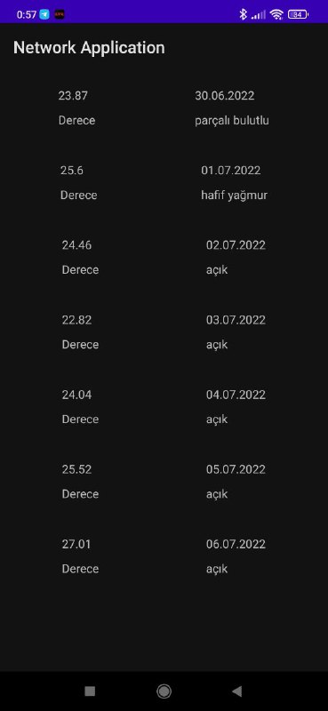

# Weather Network App

This application is developed by Tolga KALAYCIOĞLU for SENG-405 Lesson. 

Student Number: 201711040

This application simulates a Weather Apliation. It was implemented on Android Studio in Java Programming Language. 

Download APK -> [WeatherApp](https://github.com/tolgak99/FilmTrackApp/blob/master/FilmTrackApp.apk?raw=true)

